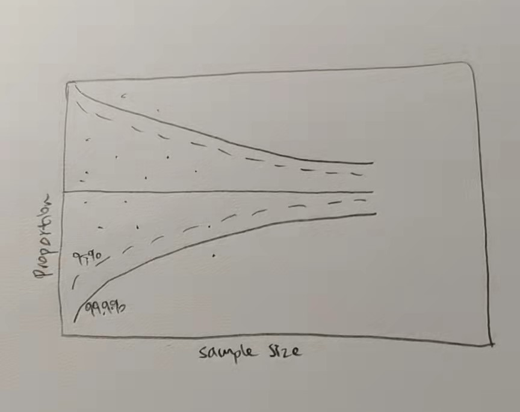

```{r setup, include=FALSE}
knitr::opts_chunk$set(echo = TRUE)
```

# 1. Introduction

## 1.1 Installing and Launching R Packages

Import the packages needed for this exercise.

```{r}
packages = c('tidyverse','readxl','dplyr','ggplot2',
             'FunnelPlotR','plotly','knitr','performance','ggpubr')
for(p in packages){
 if(!require(p, character.only = T)){
  install.packages(p)
 }
 library(p,character.only = T)
 }
```
## 1.2 Sketch of Proposed Design

Below shows the sketch of the proposed funnel plot design.

{width=30%}

# 2.Data preparation

## 2.1 Import the data

Import the sheets 'Orders' and 'Returns'.

```{r}
orders <- read_xls("Superstore-2021.xls", sheet = "Orders")
returns <- read_xls("Superstore-2021.xls", sheet = "Returns")
```

## 2.2. Data Preprocessing

Join the two data by 'Order ID' and fill in value 1 for those orders that are returned, 0 otherwise.

```{r}
joined_tab <- left_join(orders, returns, by = c('Order ID'='Order ID'))
joined_tab$Returned<-ifelse(joined_tab$Returned=="Yes",1,0) 
joined_tab[is.na(joined_tab)] <- 0
unique(joined_tab$Returned)
```

Group the data by state using group_by() function.
Calculate the proportion of returns and store the values to a new column named
'prop'.

```{r}
grouped_df <- joined_tab %>%
              group_by(State) %>%
              summarise(OrderNum = n(),
                        ReturnedNum = sum(Returned))

head(as.data.frame(grouped_df))
```
Convert column 'State' from type 'chr' to type 'Factor'.

```{r}
grouped_df <- grouped_df %>%
  mutate_if(is.character, as.factor)
```

Calculate the proportion of orders returned and store the value in column 'prop' column of 'grouped_df'.
States with zero returns are removed.

```{r}
grouped_df <- grouped_df %>%
        mutate(prop =ReturnedNum/OrderNum) %>%
        filter(prop >0)
```

## 2.3. Check for normality

A quick look at the distribution of 'prop' suggests that the data is not normal and skewed to right.

```{r}
hist(grouped_df$prop)
```

To use funnel plot to find uncertainty, we need to check for normality.
Below is a Q-Q plot for the column 'prop'.
As many of the points are not near the line, the data may not be normal.

```{r}
ggqqplot(grouped_df$prop)
```

To further confirm the observation, conduct Shapiro-Wilk test to check for normality.
As the p-value is smaller than 0.05, the data failed the test.

```{r}
shapiro.test(grouped_df$prop)
```

## 2.4. Transform the data

'prop' need to be transformed.
Below code transform the data using square root transformation.

The new p-value we get now is greater than 0.05, meaning that the data now is not significantly different from normal distribution.
We can now proceed to plot the graph.

```{r}
grouped_df$prop_tranformed <- sqrt(grouped_df$prop)
shapiro.test(grouped_df$prop_tranformed)
```

## 2.5. Plot funnel plot

Compute the lower and upper limits for 95% and 99.9% confidence interval.

```{r}
grouped_df <- grouped_df %>%
         mutate(prop_tranformed.se = sqrt((prop_tranformed*(1-prop_tranformed)) / (OrderNum))) 

fit.mean <- weighted.mean(grouped_df$prop_tranformed, 1/grouped_df$prop_tranformed.se^2)

number.seq <- seq(1, max(grouped_df$OrderNum), 1)
number.ll95 <- fit.mean - 1.96 * sqrt((fit.mean*(1-fit.mean)) / (number.seq)) 
number.ul95 <- fit.mean + 1.96 * sqrt((fit.mean*(1-fit.mean)) / (number.seq)) 
number.ll999 <- fit.mean - 3.29 * sqrt((fit.mean*(1-fit.mean)) / (number.seq)) 
number.ul999 <- fit.mean + 3.29 * sqrt((fit.mean*(1-fit.mean)) / (number.seq)) 
dfCI <- data.frame(number.ll95, number.ul95, number.ll999, number.ul999, number.seq, fit.mean)
```

Plot a static funnel plot using ggplot().

```{r}
p <- ggplot(grouped_df, aes(x = OrderNum, y = prop_tranformed)) +
  geom_point(alpha=0.4, colour = 'blue',aes(text = paste0("State: ", State,"\n","Returned %: ", round(prop*100,2),"\n",
                                                          "Order Num: ", OrderNum))) +
  geom_line(data = dfCI, 
            aes(x = number.seq, 
                y = number.ll95), 
            size = 0.4, 
            colour = "dark green", 
            linetype = "dashed") +
  geom_line(data = dfCI, 
            aes(x = number.seq, 
                y = number.ul95), 
            size = 0.4, 
            colour = "dark green", 
            linetype = "dashed") +
  geom_line(data = dfCI, 
            aes(x = number.seq, 
                y = number.ll999), 
            size = 0.4, 
            colour = "red") +
  geom_line(data = dfCI, 
            aes(x = number.seq, 
                y = number.ul999), 
            size = 0.4, 
            colour = "red") +
  geom_hline(data = dfCI, 
             aes(yintercept = fit.mean), 
             size = 0.4, 
             colour = "grey40") +
  coord_cartesian(ylim=c(-0.2,0.90)) +
  annotate("text", x = 1, y = -0.13, label = "95%", size = 3, colour = "dark Green") + 
  annotate("text", x = 4.5, y = -0.18, label = "99.9%", size = 3, colour = "Red") + 
  ggtitle("Returned Rate by State") +
  xlab("Number of orders") + 
  ylab("Transformed order return rate") +
  theme_light() +
  theme(plot.title = element_text(size=12),
        legend.position = c(0.91,0.85), 
        legend.title = element_text(size=7),
        legend.text = element_text(size=7),
        legend.background = element_rect(colour = "grey60", linetype = "dotted"),
        legend.key.height = unit(0.3, "cm"))
p
```

Using ggplotly() of plotly r package, the funnel plot can be made interactive.
In the plot below, when hovering over the points, information about state name, rate of return and order number will be displayed.
An interactive funnel plot is better as user can just hover over the points to know which State is outside the boundary.

From the funnel plot, the further a point is away from the boundaries, the more likely that it is due to special cause rather than randomness. 

```{r}
fp_ggplotly <- ggplotly(p,tooltip = "text")
fp_ggplotly
```

## 2.6. Challenges

The main point to take note is to check the normality of data. In this example, although the sample size is larger than 30, but the data failed the normality test. Therefore, it is important to always check for this assumption.

# 3. References

Test for normality: [http://www.sthda.com/english/wiki/normality-test-in-r]

Funnel plot description: [https://www.perceptualedge.com/articles/visual_business_intelligence/variation_and_its_discontents.pdf]

Creating funnel plot using R: [https://isss608-ay2021-22t2.netlify.app/hands-on_ex/hands-on_ex04/hands-on_ex04-funnelplot#computing-the-basic-derived-fields]

