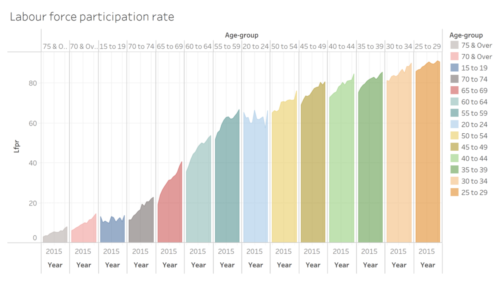

```{r setup, include=FALSE}
knitr::opts_chunk$set(echo = FALSE)
```

Distill is a publication format for scientific and technical writing, native to the web. 

Learn more about using Distill for R Markdown at <https://rstudio.github.io/distill>.


# 1. Data Visualization Critique

The "Resident Labour Force Participation Rate by Age and Sex" file provides labor force
participation rate(LFPR) at different age groups from year 1991-2021.

The intended visualization aims to show LFPR by age group for each year from year 2010-2021.
The original design as shown below has clarify and aesthetic issues which will be discussed 
in the next section.

{width=80%}

## 1.1. Critiques: Clarity

**(a) Improper labeling and formatting of both x-axis and y-axis:**

The first two labels "75 &O.." and "70& Ov.." for Age-group are not shown entirely,it would be better to flip the direction of label so that all labels for age group can be seen properly.

The label on the bottom x axis is misleading, as the graph is intended to show population from year 2010-2021, but the label only shows 2015. As the graph needs to show LFPR from year 2010-2021
for each age group, this information should be easily identified by the user. As an improvement, a bar graph can be used to represent the LFPR value for each year under each age group. In this case, one color corresponds to a year, and user can identify the LFPR value for each year by referring to the legend.       

On the y-axis, the 'Lfpr' should be all capital letters. And it is not clear to the user what unit the axis is in. It would be better if the unit '%' can be shown.

**(b) Improper visualization header:**

The title does not tell user clearly for what category the LFPR is shown for. It would be better if the title can mention that the LFPR is for each year from 2010-2021 of each age group.

Also, as 'LFPR' label of the y-axis is a short form for 'Labour force participation rate', it would be better to include it in a bracket beside the title so that user knows its meaning.

There is no subtitle, having a subtitle explaining the key observations from the graph can make it easier for user to understand the visualization.


## 1.2. Critiques: Aesthetics

**(a) Redundant grid line:**

The shallow grid lines within each age group are redundant as it does not help in the visualization of any categorization of data and may be confusing to user when looking at it. Hence, it can be removed.

**(b) Redundant color for each age group:**
As each categorization of age group can be identified from the 'Age-group' axis label, is it redundant to assign different colors to different age groups and stated it in the legend. Instead, color can be used to differentiate year within each age group.

**(c) Title and axis label does not stand out:**
Title is not in bold, and the axis label 'Lfpr' and 'Age-group' is too small, making the three main labels in the graph not standing out. Hence, it will be better to increase size of axis label and format title as bold.

# 2. Sketch of Proposed Design

The proposed design consists of bar graph for each year under each age group. The legend displays the color corresponding to each year. In this way, user can inspect the years as a whole, or only individual years according to color.

An additional section displaying the percentage change of LFPR from previous year is added, this help user to understand the degree of fluctuation in LFPR for each age group.


# 3. Data Visualization

## 3.1. Data Preparation

**Step 1:**

The data is downloaded from Ministry of Manpower website [webite link](https://stats.mom.gov.sg/Pages/LabourForceTimeSeries.aspx) titled 'Resident Labour Force Participation Rate by Age and Sex'.

{width=50%}

Under sheet 'mrsd_Res_LFPR_2', the data for each age group from year 1991 to 2021 is available.
As the visualization is only going to focus on Total, will create a separate sheet named 'Total' to store the data.

**Step 2:**

{width=50%}

The columns containing data for year 1991-2009 are deleted as the visualization only focuses on year 2010-2021. As the visualization only focuses on LFPR per age group, the row 'Total' can be deleted. Also,the row '70 & over' can be deleted as it can be separated into '70 to 74' and '75 & Over' and just retaining the later two rows are enough. 

### Import data into Tableau

**Step 1:** 
Import sheet 'Total' into Tableau

{width=50%}

**Step 2:** 
Click on 'Use Data Interpreter' to clean the data.
The result is columns are now with proper header 'Age (Years)/Sex' and years from 2010-2021.

{width=50%}

**Step 3:**
Change column name 'Age (Years)/Sex' to 'Age group' by clicking on the 'rename' option and making the corresponding change.

{width=50%}

**Step 4:**
Select all columns from 2010-2021, right click and select 'pivot':

{width=50%}

In the resulting table, change the column name 'Pivot Field Names' to 'Years' and 'Pivot Field Values' to 'LFPR(%)'.

{width=50%}

## 3.2 Create graphs

### 3.2.1. Create the first graph

**1. Create the basic parts of the graph**
  -Drag 'Age Group' and 'Years' to **Columns**, 'LFPR%' to   
   **Rows**, and drag 'Years' to **Color**, the following 
   graph is displayed.

   {width=50%}

**2. Adjust the labels and titles.**
  -Right click on the 'Age Group / Years' axis and select 
  'Rotate Label' to change the label orientation.

  -Right click on the bottom x-axis and uncheck 'Show 
   Header'.

  -Double click on 'Sheet 1' and type the title on the pop up    box as shown below. Format the title as bold with font 
   size 12.
   
  -In the same pop up box, type subtitle under title, format 
  the subtitle with font size 10. Align both title and 
  subtitle to center.

  {width=50%}

  -Right click on 'Age Group' and select 'Format'. Click on 
  'Font' under 'Default' as shown below and increase size to 
  11. Apply the same process to 'LFPR(%)' label of the 
  y-axis.

  {width=30%}
  Above changes produce the following result:

  {width=50%}

**3. Add reference line**
  -Under Analytics, drag 'Average Line' to the graph and drop    it under 'Pane' for 'SUM(LFPR(%))'.

  {width=30%}

  The reference lines are now displayed on the graph:

  {width=60%}
  
  -To show the values of reference lines, right click on any    reference line, in the pop up box, select 'Value' for   
  'Label'. 

  {width=50%}

  The values are now displayed:
  {width=50%}

### 3.2.2. Create the second graph

**1. Create the second graph**

  -Drag 'LFPR%' to **Rows** again, right click on the second   'SUM(LFPR(%))' as shown below and select 'Add Table     
  Calculation'.

  {width=50%}

  -In the pop up window, for 'Calculation Type', select   
  'Percent Difference From', and for 'Compute Using', select   'Specific Dimensions' and uncheck 'Age Group'.

  {width=50%}
  Above changes will produce a second graph as shown below:

  {width=50%}
  -Click on '>13 nulls' shown at the bottom right corner and    select 'Show data at default position'.

  -Rename the sheet as 'graph1-2' by right clicking on 'Sheet   1' tab at the bottom and select 'rename'.

  {width=50%}
**2. Add in annotation and remove row grid lines**
  -right click on the second graph and select   
   'Annotate'->'Area'. Type the annotations and click 'OK'.
  A short description of the main observations is now shown 
  on the the second graph. Move the annotation to desired 
  area so that it does not overlap with the bars.

  {width=50%}
  -Under 'Format'->'Lines', select None for row grid lines.
  
### 3.2.3. Create the third graph

**1. create a new sheet. **
  -drag 'Age Group' to **Columns** and 'LFPR(%)' to **Rows**.
  -drag 'Years' to **Filters** and select only year 2010 and 
   2021.
  -change **Marks** to 'Line'.
  -drag 'Years' to 'Path'.
  -drag 'LFPR(%)' to **Rows** again and right click and check    'Dual Axis'
  Above changes will produce following graph:
  
  {width=50%}
 
 
  -set **Marks** as shape and drag 'Years' to **Detail**
  
  The following graph is produced:
  
  {width=50%}
  
**2. create table calculation**
  -create new calculated field called 'Difference'
  -click 'Analysis'->'Create Calculated Field' and fill in      the formula shown in the picture below.
  -click 'Default Table Calculation' and set 'Compute using'    as 'Years'.
  -click 'Ok'.

  {width=50%}

   -create new calculated field called 'Direction'
   -the calculation depends on the value of difference.
   
   {width=50%}
   
**3. create arrow and update colors**

  - drag 'Direction' to 'Color' for both 'SUM(LFPR(%))'
  -click on 'Color' and select 'Edit Colors' and change to 
    the color to red and blue as shown below:

  {width=50%}
  -drag 'Direction' to 'Shape'. Click on 'Shape' and change     the shape to triangle as shown below:

   {width=50%}

   Above changes will add triangle and color to the lines:

   {width=50%}
   -to remove the extra triangle, create a new calculated 
    field called 'Size_calculated', and drag 
    'Size_calculated' to 'Size' under the second 
    'SUM(LFPR(%))'.
   
    {width=50%}
    
    
   -Drag 'Direction' to 'Color' under the first 
    'SUM(LFPR(%))'.
   -click 'Color' and select 'All' for 'Markers'.
   -right click on the right y axis and click 'Synchronize 
    Axis'
   -click on 'Size' under second 'SUM(LFPR(%))' and adjust 
    the size of the arrow.
  
  Above changes produce the following graph:
  {width=50%}

**4. Add in Labels**
  
  -Drag 'Difference' to 'Label' under the second 
   'SUM(LFPR(%))'.
  -click on 'Label', change 'Text' to '<AGG(Difference)>%',
   under 'Font', choose 'Match Mark Color',
   and for 'Alignment' change to Top Right.
  -as there will be repeated labels on the graph, right click    the repeated labels and select 'Mark Label'->'Never Show'    to hide it.
  
   {width=50%}

**5.edit title, hide axis and adjust grid lines**

-Update the title name as '% Change in Population from  
 2020-2021'. 

-Hide the right y-axis by right clicking on it and uncheck 
 'Show Header'. Hide the x-axis in the same way.
 
-Under 'Format'->'Lines', select None for row grid lines

-set column grid lines and set the color to light grey.

-hide all cards on the right.

-rename the sheet as 'graph3'.

### 3.2.4. Create the final dashboard

-Drag 'graph1-2' and 'graph3' onto the dashboard.
-Place 'graph3' at the bottom and align its vertical 
 grid lines with 'graph1-2'.


# 4. Main Observations

1. It can be observed that the age groups having high LFPR are from 25-54. Each age group within this range has average LFPR above 80% over the year 2010-2021.

2. However, for age groups within the age range of 25-54 has low % change in LFPR per year as shown by the low bar heights.


{width=50%}

Point 1 together with point 2 indicates that the LFPR for working age within 25-54 is high over the years and the values are relatively stable too.

3. Age groups 65-69, 70-74 and 70 & over are having increasing trend in LFPR over the years. This can be observed by the increasing bar height for LFPR over 2010-2021. This corresponds to the % difference bar chart too, as it can be observed that most of the bars are of positive value, indicating an increasing trend. This indicates that more elderly are participating in work, creating more labor force for Singapore.


