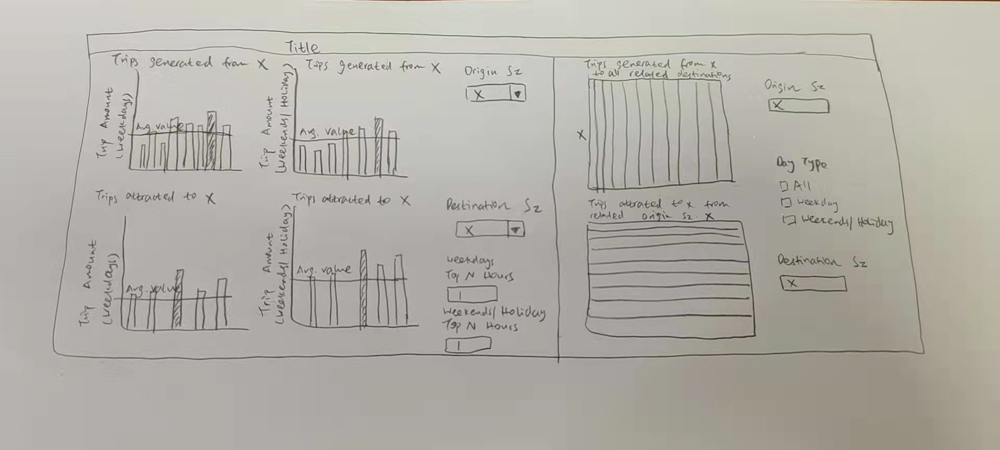

 
```{r setup, include=FALSE}
knitr::opts_chunk$set(echo = FALSE)
```

# 1. Data Visualization Critique

The original visualization aims to reveal inter- and intra-zonal public bus flows 
at the planning sub-zone level of January 2022.

{width=60%}


A good visualization should be both clear and visually appealing.           
Next section will focus on critiques of the original  visualization based on clarity and aesthetics. 

The overall approach is to use the four quadrant to critique the graphs, as well as 
including improvements that can be made to improve interactivity.

{width=30%}

## 1.1. Critiques: Clarity       

**(a) Dashboard has no title**

Without a proper title, user may find it confusing about what the dashboard is showing.
As the dashboard is showing inter- and intra-zonal public flows at the planing sub-zone level of January 2022, it would be useful to add this information in the title.

**(b) Improper labeling of x-axis for bar charts:**

For 'WEEKENDS/HOLIDAY' label, only 'WEEKENDS' is shown. This makes the label not clear to the user
that the day type is 'WEEKENDS/HOLIDAY' instead.
This can be adjusted by rotating the label to vertical orientation or add the day type 
information in subtitle so that it is clear.

**(b) Adjacency matrix showing too many values:**

The two adjacency matrix are showing too many values. As the space on a dashboard
is limited, the adjacency matrix cannot occupy too much space, making it 
confusing for user to make sense of the matrix.
It would be clearer if can reduce the values shown on the matrix so that user can 
make sense of the matrix. For example, for a selected 'Origin Sz', it would be helpful 
to show trip amount just for this Subzone and corresponding destination Subzones as 
user can then analysis which destination Subzone attracted more trips from the selected
origin Subzone.

**(d) Different y axis values making it hard to make comparisons**

As the y-axis values for bar charts are different, if user want to compare across
bar charts, it will be confusing to them.
This can be solved by adding a reference line to each bar chart showing the average trip amount.

## 1.2. Critiques: Aesthetics

**(a) Color too dull for adjacency matrix**

The grey color for both adjacency matrix is too dull and not visually appealing.
Using different colors for each will be better.

**(b) Single color for all bar charts **

Only blue color is used for all bar charts, different colors can be used to 
better help user to differentiate weekdays and weekends/holiday.

**(c) Subtitle does not stand out**

Subtitles are not in bold, it will be better to format it as bold.

## 1.3. Critiques: Interactivity

**(a) Not enough view manipulation for bar charts**

The bar charts will change according to the 'Origin Sz' and 'Destination Sz' chosen.
However, just showing the bars does not help user to identify points of interest.
For example, use may want to look at the hours with more number of trips.
Hence, it would be useful if user can select to check the top N hours with most number 
of trips.

**(b) User input only affect of bar charts**

When selecting 'Origin Sz' or 'Destination Sz', corresponding bar charts changed, 
but the adjacency matrix does not seem to change. 
Hence, it would be helpful to include other filters for adjacency matrix for user to interact
with the display.

**(c) Tooltip for adjacency matrix not clear** 

When hovering over the adjacency matrix, the tooltip shows values for 
'Origin Sz', 'Destination Sz' and '% of Total Total Trips along Table (Across)'.
However, the name for the last value is too long and can be confusion to the user.
It would be better to just change it to 'Total Trips Percent'.

Also, apart from percentage value, adding more information such as 
absolute value of bus trips can be helpful as it helps user to understand
the magnitude of number of trips in which percentage is calculated upon.

**(d) Single value list not convenient for user**

As there are more than a hundred Subzones, it is inconvenient for use to acroll 
down the single value list and find the Subzone they want to inspect.
Change the Single value list such that a Subzone be be found by typing its
name will be more convenient for user.

# 2. Sketch of Proposed Design

Below shows a sketch of the proposed design. 

{width=50%}

+ There are two sections for the dashboard.

+ The first section is on the left side, including 4 bar charts and filters for user input.
  + User can type their choice of subzone under 'Origin Sz' and 'Destination Sz', which the 
    changes will be reflected in the top two bar charts for 'Origin Sz'm, and bottom two
    bar charts for 'Destination Sz'.
  + User can also input the Top N Hours they want to inspect for Weekdays or Weekends/Holiday.
    + The bar charts corresponding to the time in hour will be highlighted.
  + Reference lines containing average value are added for each bar charts for easier comparison.

+ The second section is on the right side, including two adjacency matrix and filters for user input.
  + Similar to the first section, user can type their choice of subzones under 'Origin Sz' and 'Destination Sz'.
  + The top adjacency matrix will show the trip amount from the 'Origin Sz' selected to all the associated
    destinations.
    The bottom adjacency matrix will show the trip amount to the 'Destination Sz' selected from all the associated
    origin subzones.
      + The difference in trip amount will be highlighted by difference in color.
      + User can hover over the matrix to check for trip amount and percent of trip amount for each 
        destination/origin.
    
  + Under Day Type, user can select whether to include weekday or weekends/holiday data or all data.

+ Title is the title of the dashboard, which will present a short description of 
  the overall information displayed.


## 3 Create graphs

This section will shows the detail process of creating the graphs.

## 3.1: Data used

Drag the data 'origin_destination_bus__SZ_202201.csv' to Tableau.
The data contains information about trip amount, day type, origin subzone and destination subzone etc.

## 3.1 Create the graphs

This section will describe the steps for creating the graphs.
In total, there are four bar charts, two adjacency matrix and one dashboard that need to be created.

### 3.2.1. Create the first graph

+ **Step 1**: Create a new sheet and name it as 'bar_ori_1'.

+ **Step 2**: Create new dimensions and measures according day type.
  + To create a calculated field, click: 
    **Analysis->Create Calculated Field**.
  + Create 4 calculated fields with name and formula as shown      below:
    
    {width=30%}
    {width=30%}
    {width=30%}
    {width=30%}
    
  + Right click on 'Time Per Hour' and select **Convert to Dimension'**, 
    do the same change to 'time_per_hour_weekdays' and 'time_per_hour_weekends'.
  + Drag 'time_per_hour_weekdays' to Columns and 'total_trips_weekdays' to Rows.
    
+ **Step 3**: Create 'Weekdays Top N Hours' parameter
  + Drag 'time_per_hour_weekdays' to **Filters**.
  + Under General, deselect 'Null'.
  
    {width=30%}
  + Under Top, click on the box highlighted in red as shown below and select
    'Create New Parameter':
    
    {width=30%}
    
  + In the pop up box, make the below changes:
      + Set 'Name' as 'Weekdays Top N Hours'
      + Change 'Data Type' to 'Integer'
      + Set 'Current Value' to 3
      + Set 'Allowable values' as 'Range'
      + Set 'Minimum' to 1, 'Maximum to' 23 and 'Step Size' to 1.
      + Click OK
  
        {width=30%}
  
  + After creating the parameter, select 'None' under 'Top'.
  + Right click the 'Weekdays Top N Hours' parameter and select 'Show Parameter'.
  
+ **Step 4**: Create set 'time_per_hour_weekdays_set' 
  + Right click on 'time_per_hour_weekdays' and select 
    **Create -> Set**.
  + Under 'Top', make the below change:
  
    {width=30%}
    + Drag the newly created set to 'Color'.
    
+ **Step 5**: Create 'Origin Sz' filter.
  + Drag 'Origin Sz' to 'Filters', select all except 'null'.
  + Click OK
  
  {width=30%}
  + Right click on the 'Origin Sz' filter and select 'Show Filter'.
  + Change the filter show on the right side to 'Single Value (list)'.
  + Right click on the filter again and select 'Add to Context'.
 
+ **Step 6**: First Graph created
  + Set view to 'Entire View'
  
    {width=20%}
  + Below shows the first graph created:
  
    {width=30%}


### 3.2.2. Create the second graph

+ **Step 1** Create a new sheet and name it as 'bar_ori_2'.
   + Drag 'time_per_hour_weekends' to Columns and 'total_trips_weekends' to Rows.

+ **Step 2**: Create 'Weekends/Holiday Top N Hours' parameter
  + The process is the same as described in Step 3 of section 3.2.1.
  + Drag 'time_per_hour_weekends' to **Filters**.
  + Under General, deselect 'Null'.  
  + Under Top, select 'total_trips_weekends' and 
    click on the box highlighted in red as shown below and select
    'Create New Parameter':
  
    {width=30%}
 
  + In the pop up box, make the below changes:
      + Set 'Name' as 'Weekends/Holiday Top N Hours'
      + Change 'Data Type' to 'Integer'
      + Set 'Current Value' to 3
      + Set 'Allowable values' as 'Range'
      + Set 'Minimum' to 1, 'Maximum to' 23 and 'Step Size' to 1.
      + Click OK
  
      {width=30%}
  
  + After creating the parameter, select 'None' under 'Top'.
  + Right click the 'Weekends/Holiday Top N Hours' parameter and select 'Show Parameter'.
  
+ **Step 3**: Create set 'time_per_hour_weekends_set' 
  + Right click on 'time_per_hour_weekends' and select 
    **Create -> Set**.
  + Under 'Top', make the below change:
  
    {width=30%}
    + Drag the newly created set to 'Color'.
    
+ **Step 4**: Create 'Origin Sz' filter.
  + The processes are the same as Step 3 in section 3.2.1.
 
+ **Step 5**: Second Graph created
  + Below shows the second graph created:
  
    {width=30%}

### 3.2.3. Create the third graph

+ **Step 1**: Create the third graph
  + Right click on the first graph's name and select 'Duplicate'.
  + Rename the new graph as 'bar_dest_1'.

+ **Step 2**: Change the Subzone filter
  + Remove 'Origin Sz' from 'Filters'.
  + Drag 'Destination Sz' to 'Filters'.
  + Following the same steps of creating filter as described in Step 3 of section 3.2.1.
  
+ **Step 3**: Third graph created
  + Below shows the third graph created:
  
    {width=30%}

### 3.2.4. Create the fourth graph

+ **Step 1**: Create the third graph
  + Right click on the second graph's name and select 'Duplicate'.
  + Rename the new graph as 'bar_dest_2'.

+ **Step 2**: Change the Subzone filter
  + Remove 'Origin Sz' from 'Filters'.
  + Drag 'Destination Sz' to 'Filters'.
  + Following the same steps of creating filter as described in Step 3 of section 3.2.1.
  
+ **Step 3**: Fourth graph created
  + Below shows the fourth graph created:
  
    {width=30%}

### 3.2.5. Create the fifth graph

+ **Step 1**: Create a new sheet named 'matrix_dest'.

+ **Step 2**: Create parameter 'Destination Sz'
  + Move 'Destination Sz' to Columns.
  + Right click on any white space under Parameter and select  
    'Create Parameter'.
  + Set 'Name' as 'Destination Sz'
  + Set 'Data Type' as 'String'
  + Select 'List' for 'Allowable Values'.
  + Click on 'Add Values from' and select 'Destination Sz'.
  + Click OK and a new parameter named 'Destination Sz' is now 
    created.
  + Right click on the parameter and select 'Show Parameter' to view it.

  {width=50%}
+ **Step 3**: Create calculated field
  + Right click on any white space under Tables and select 'Create Calculated field'.
  + Enter the name and formula of the calculated field as below:

  {width=50%}

  + Drag the calculated field to Rows.
  + Drag the calculated field to filter and deselect 'Null'. 
  + Click OK.

  {width=30%}
+ **Step 4**: Create filter for day type
  + Dragging 'Day Type' to Filters.
  + Select all and click OK.
  + Right click on the 'Day Type' filter and select 'Show Filter'.
  
  {width=30%}

+ **Step 5**: Fifth graph created
  + Drag 'Total Trips' to color.
  + Right click on any rows below 'Filter Origin SZ by Destination SZ' 
    and deselect 'Show Header'.
  + Set view to 'Entire View', the graph is now created.
  
   {width=50%}

### 3.2.6. Create the sixth graph:

+ **Step 1**: Create a new sheet and name it as 'matrix_ori'.

+ **Step 2**: Create a new parameter named 'origin Sz' 
  + Drag 'Origin Sz' to Rows.
  + Create a new parameter named 'origin Sz' by following the same step 
    of creating parameter 'Destination Sz' in Step 2 of section 3.2.5. 
    + The difference is select 'Origin Sz' for 'Add values from'.
  
+ **Step 3**: Create a new calculated field named 'Filter Destination SZ by Origin Sz' 
  + Right click on any white space under Tables and select 'Create Calculated field'.
  + Enter the name and formula of the calculated field as below:

  {width=50%}

  + Drag the calculated field to Columns.
  + Drag the calculated field to filter and deselect 'Null'. 
  + Click OK.
  
+ **Step 4**: Create filter for day type
  + Dragging 'Day Type' to Filters.
  + Select all and click OK.
  + Right click on the 'Day Type' filter and select 'Show Filter'.
  
+ **Step 6**: Sixth graph created
  + Drag 'Total Trips' to color.
  + Right click on any columns below 'Filter Destination SZ by Origin Sz' 
    and deselect 'Show Header'.
  + Set view to 'Entire View', the graph is now created.
  
   {width=50%}
 
 
### 3.2.7. Create the final dashboard:

+ **Step 1**: Create the dashboard

  + Position the graphs as shown below:
    + Change the width to 1250, and height to 600 to fit all graphs in one page.
    + As the labeling and filters are not clear to users, changes are needed.
    
    {width=50%}

+ **Step 2**: 

  + For all graphs: adjust header and axis label of graphs
    + Right click on the header, in the pop up box, made the changes as shown 
      in the below graph:
      + Parameter can be inserted by clicking on 'Insert' and select the 
        parameter to insert.
        
       {width=30%}
  
       + Update the headers of the 6 graphs with respective title.
  
  + For the first 4 bar charts:
    + Change color of 'In' bars to Pink for 'bar_ori_2' and 'bar_dest_2'.
    + Change color of 'In' bars to Orange for 'bar_ori_2' and 'bar_dest_2'.
    + Right click on the left x axis and select 'Edit Axis'.
     + Change axis name to 'Trip Amount (Weekdays)' or 'Trip Amount (Weekends/Holiday)'.
  
    + Right click on the top y axis and select 'Hide Field Labels for Columns'.
    + Right click on 'Tooltip':
      + deselect first two lines
      + change 'time_per_hour_weekdays' to 'Time in Hour'.
      + change 'total_trips_weekdays' to 'Total Trips'.
    
       {width=30%}
  
  + For graph 'matrix_ori':
    + Right click on left x axis and select 'Rotate Label'.
    + Right click on 'Origin Sz' and select 'Hide Field Labels for Rows'.
    + Click 'Tooltip' and change 'Filter Destination SZ by Origin Sz' to
      'Destination Sz'.
    + Change 'Color' to Green.
   
  + For graph 'matrix_dest': 
    + Right click on 'Destination Sz' and select 'Hide Field Labels for Columns'.
    + Click 'Tooltip' and change 'Filter Origin SZ by Destination SZ' to 'Origin Sz'.

  
+ **Step 3**: Synchronize filters

  + Right Click 'Origin Sz' filter in sheet 'bar_ori_1' and click 
    'Apply to Worksheets'->'Selected Worksheets'.
    + Check 'bar_ori_2'.
  
    {width=50%}
  + Right Click 'Destination Sz' filter in sheet 'bar_dest_1' and click 
    'Apply to Worksheets'->'Selected Worksheets'.
    + Check 'bar_dest_2'.
  
  + Right Click 'Day Type' filter in sheet 'matrix_dest' and click 
    'Apply to Worksheets'->'Selected Worksheets'.
    + Check 'matrix_ori'.

+ **Step 4**: Adjust filters and legends

  + Change the type of filters and parameters so that user can type the subzone name to select.
    + Change 'Origin Sz' and 'Destination Sz' filter for the four bar chart to 
      'Single Value (dropdown)'.
    + Change the Parameter 'Origin Sz' and 'Destination Sz' for the two adjacency matrix
      to 'Type In'.

  + Only retain the following filters and legends:
    + Total Trips legend for both matrix graphs.
    + 'Origin Sz' and 'Destination Sz' for bar charts and adjacency matrix.
    + Parameter 'Weekdays Top N Hours' and 'Weekends/holiday Top N Hours'
      for the two adjacency matrix.
    + 'Day Type' filter for the two adjacency matrix.
    
  + For 'Day Type' filer, select 'Edit Title' and add 
    '(Only applies to adjacency matrix)' so that user understand the change will only 
    affect adjacency matrix, increase height to 200 to show all the options.
    
  + Add in percentage value for adjacency matrix
    + As only absolute values are shown, it would be useful to add in % of total trips 
      for easier comparison.
    + On the 'matrix_dest' sheet, drag 'Total Trips' to 'Tooltip'.
    + Right click on 'Total Trips' and select 'Add Table Calculation'.
    + Set the table calculation as shown below:
    
       {width=20%}
    
    + Click on 'Tooltip' and add percentage of total trips as shown below:
    
      {width=20%}
    + Apply the same changes to 'matrix_ori', select 'Table(across)' instead.
    
  + The final dashboard is created after arranging the filters and legends
    as shown below:
     
    {width=70%}

# 4. Main Observations

Using the subzone 'CHANGI WEST' as an example input, we can observe the following:

{width=50%}

**1. Different average trip amount between different day types** 

From the graph, it can be observed that the trip amount for trips generated from
or attracted to a particular subzone such as 'CHANGI WEST' is different between 
weekdays and weekends/holiday as shown by the different average trip amount on the reference line.

The trips generated from or attracted to 'CHANGI WEST' during weekends/holiday is generally less than
that of weekdays. This makes sense as weekdays have longer duration.

**2. Similar time in hour having top N amount of trips** 

Although the average difference between different day types are different, but the trend
of trip amount over time in hours are similar for the same origins subzone or
destination subzone. 
This means the top N hours arranged according to number of trip are also similar 
for both day types. This is observed in the particular example of 'CHANGI WEST' 
whereby the top 5 hours for both day types are similar.
   
**3. A subzone can generates or attracts most of its trips from a few other subzones**    

Arranging the adjacency matrix by clicking on the button circled in red below, we can 
check the associated location with most number of trips.

 {width=30%}
 
This is supported by the particular example of 'CHANGI WEST', it has the 49.48% of trips to 'TAMPINES EAST',and 60.02% of trips from 'TAMPINES EAST'. Although it has trips linking to many other subzones, but other subzones account for only around 10% or less than 10% of the trips.

# 5. References

Link for creating parameters : (https://www.tableau.com/learn/tutorials/on-demand/parameters?_ga=2.201039597.2110822164.1648026853-1224120818.1642181744)

Link for showing legend on dashboards:
(https://kb.tableau.com/articles/howto/showing-legends-on-dashboards)

Calculate Percentages in Tableau:
(https://help.tableau.com/current/pro/desktop/en-us/calculations_percentages_options.htm)

Parameters in Tableau:
(https://interworks.com/blog/rcurtis/2016/06/02/tableau-deep-dive-parameters-filtering-across-data-sources/)
